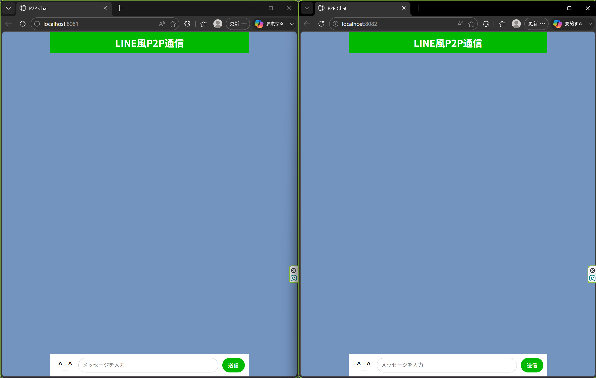
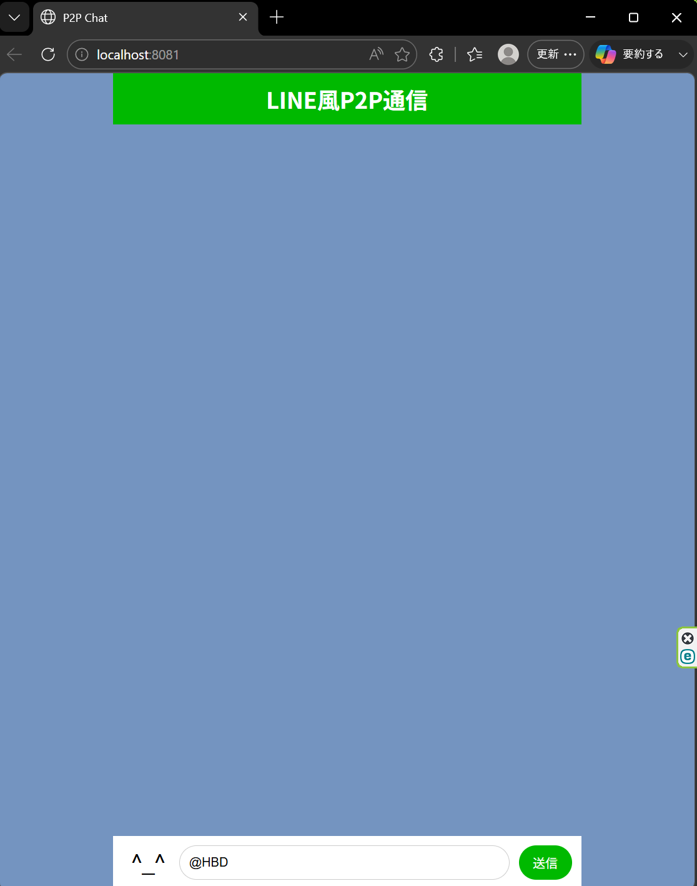
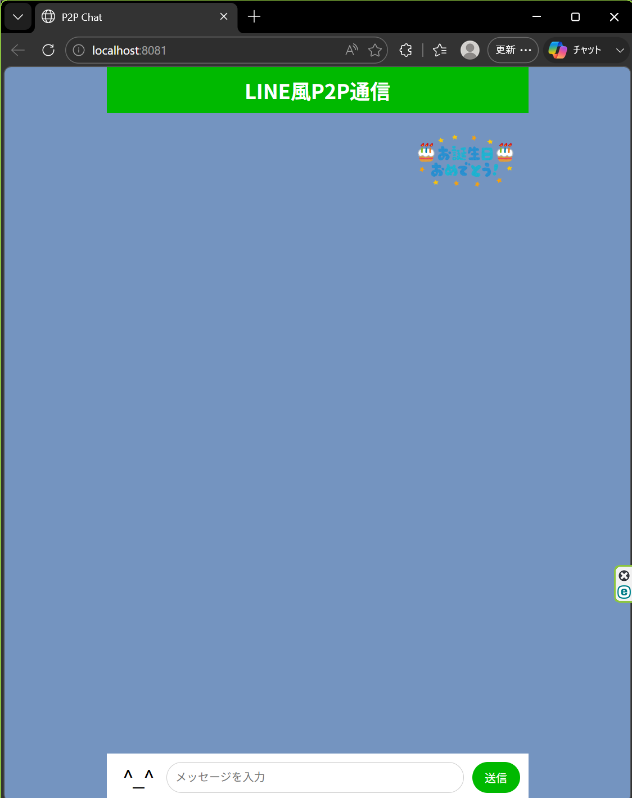
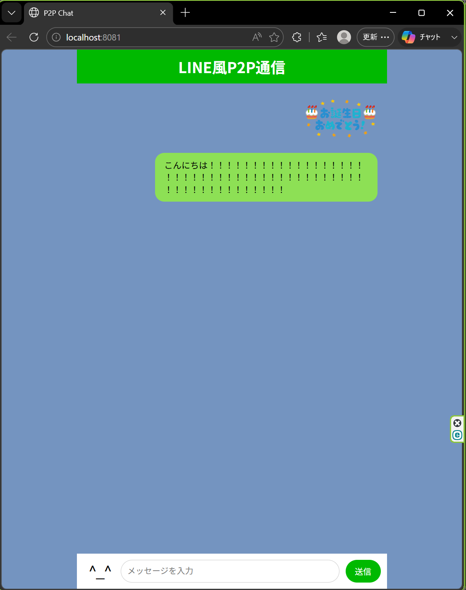
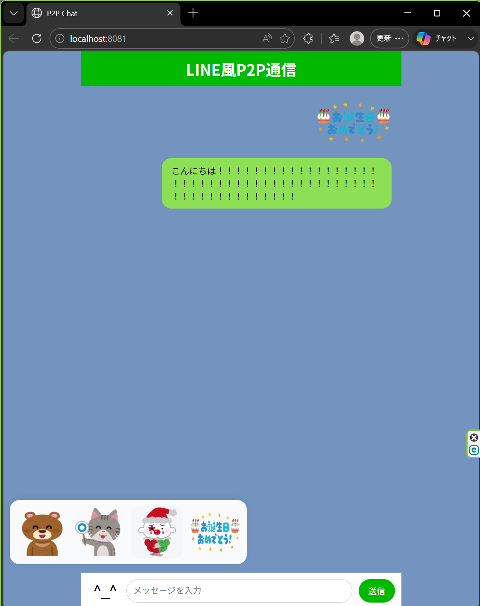
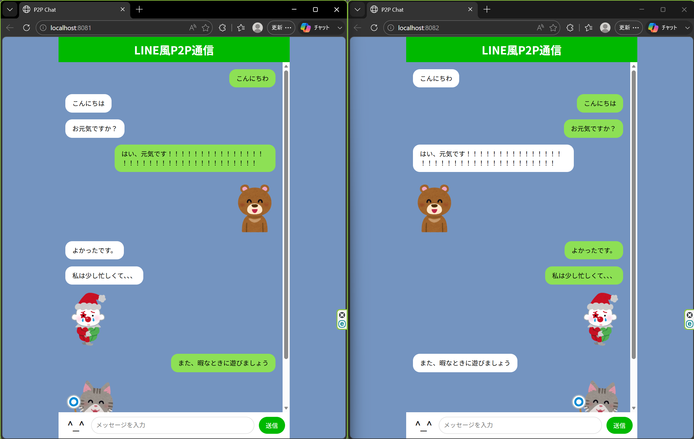

# Simple_P2P_chatsystem (C & Go Comparison + Web UI Extension)

ネットワークプログラミングの基礎であるソケット通信を題材に、同ネットワーク内の2者間でのリアルタイム通信を実装しました。
C言語とGo言語による低レイヤーからのアプローチ比較に加え、Go言語とWebSocketを用いたLINE風のモダンなWeb UIチャットアプリケーションへと拡張を行っています。

## 1. C言語による2つのアプローチの比較 (`chatsystem_C`)
C言語版では、抽象度の異なる2種類の実装を行いました。

| 比較項目 | Socket 通信 UDP (`udp_chat.c`) | Raw Socket (`raw_chat.c`) |
| :--- | :--- | :--- |
| **抽象度** | **高い**（OSがヘッダーを自動処理） | **低い**（ヘッダーを自力で構築） |
| **主な処理** | `sendto` / `recvfrom` の単純な呼出 | IP/UDPヘッダー構築、チェックサム計算 |
| **実行権限** | 一般ユーザー権限 | **管理者権限 (sudo)** が必須 |
| **実装の難易度** | 中（ソケットプログラミングの基礎） | 高（パケット構造の理解が必要） |
| **I/O 多重化** | `epoll` による多重化 | `epoll` による多重化 |

## 2. Go言語での実現（CLI版） (`chatsystem_Go_CLI`)
C言語の実装ではヘッダーや多重化の処理が煩雑でしたが、Go言語では同機能の実装がより簡単に記述できました。

* **C言語:** `epoll_wait` を含むイベントループを自分で管理し、発生したイベントを条件分岐で処理。構造体の初期化やバイトオーダーの変換処理が必要。
* **Go言語:** 受信処理をGoroutineとして切り出し、Goのランタイムが内部的にepoll等を管理するため、コード上では「入力待ち」と「受信待ち」を独立した直列処理として扱える。

## 3. Go言語 + WebSocketによるWeb UI化 (`chatsystem_Go_WebUI`)
CLIでのP2P通信をバックエンドとして活かし、フロントエンド（HTML/CSS/JS）と連携させたLINE風のWebアプリケーションへと拡張しました。

* **アーキテクチャ:** ブラウザ ⇔ (WebSocket) ⇔ Goサーバー ⇔ (UDP/P2P) ⇔ 相手のGoサーバー
* **追加機能:**
    * JSONベースの通信プロトコルへの移行
    * 動的なIPアドレスのUI表示
    * スタンプ送信機能（パレットUIおよび `@happy` 等のコマンド入力）

## 4. 実行コマンド

### 4.1 C言語版 (`udp_chat.c` / `raw_chat.c`)
① `cd chatsystem_C`
② `make start`
③ `make login-node1`
④ `gcc udp_chat.c -o udp_chat` (または raw_chat)
⑤ `./udp_chat 10.100.0.20` (raw_chatの場合は `sudo` が必要)
⑥ (別画面で①の後) `make login-node2`
⑦ `./udp_chat 10.100.0.10`
⑧ チャット開始

### 4.2 Go言語 CLI版 (`go_chat.go`)
① `cd chatsystem_Go_CLI`
② `make start`
③ `make login-node1`
④ `go run go_chat.go 10.100.0.20`
⑤ (別画面で①の後) `make login-node2`
⑥ `go run go_chat.go 10.100.0.10`
⑦ チャット開始

### 4.3 Go言語 Web UI版
① `cd chatsystem_Go_WebUI`
② `make start` （docker-compose等でホストへのポートフォワーディング 8081/8082 を設定）
③ `make login-node1`
④ `go run go_chat.go 10.100.0.20`
⑤ (別画面で①の後) `make login-node2`
⑥ `go run go_chat.go 10.100.0.10`
⑦ ホストマシンのブラウザから `http://localhost:8081` (Node1) と `http://localhost:8082` (Node2) にアクセスしてチャット開始

## 5. C言語実装に対する、Go言語実装のメリット・デメリット
### メリット
* **高い生産性と可読性:** C言語ではepollなどの複雑なコードにより100〜150行必要だった処理が、Go言語では約60行で実装できた。
* **メモリ安全性:** 固定長バッファの管理やオーバーフローのリスクが、Goのスライスとガベージコレクションによって解消される。
* **標準ライブラリの強力さ:** WebSocketサーバーやHTTP配信など、外部の巨大なフレームワークを使わずに標準機能＋小規模パッケージでモダンな機能を追加できる。

### デメリット
* **低レイヤーへのアクセスの制限:** `raw_chat.c` のようなIPヘッダーを1ビット単位で操作する処理は標準ライブラリの範囲外となる。
* **ランタイムの隠蔽:** epollやシステムコールがどのように呼ばれているかが見えにくく、ブラックボックス化する。
* **バイナリサイズとオーバーヘッド:** ランタイムを含むためC言語に比べるとサイズが大きくなり、チャット開始までの初期起動時間は体感でもC言語より長くなる。

## 6. 実装の様子
C言語での実装とGoのCLI版の実装では以下のようなチャットが可能になった。

  
  

GoのWebUI版では以下のような機能などを実装した。
<table align="center">
  <tr>
    <td align="center">
       
      ①画面の初期状態
    </td>
    <td align="center">
       
      ②「@特定の文字列」によるスタンプの送信法
    </td>
    <td align="center">
       
      ②「@特定の文字列」によるスタンプの送信法
    </td>
  </tr>
</table>
<table align="center">
  <tr>
    <td align="center">
       
      ③長文入力時の自然な折り返し
    </td>
    <td align="center">
       
      ④スタンプ一覧
    </td>
    <td align="center">
       
      ⑤会話後の様子
    </td>
  </tr>
</table>

### 動作デモ
以下は、実際にWeb上で動かした様子です
https://github.com/user-attachments/assets/cd7f14ff-90b5-4c49-91f8-6d4f5c61d3a2

## 7. 結論
ソケットプログラミングの基礎を学び、実際にC言語で実装することでパケット構造やI/O多重化の低レイヤーな挙動について学びを深めることができました。更に、Go言語を用いて効率的に抽象化を行うことで、低レイヤーのUDP通信とモダンなWebフロントエンド（WebSocket）をシームレスに結合するフルスタックな開発手法を体験できました。
この「リアルタイム双方向通信」と「JSONによるイベント駆動」の知見を活かし、次はGo言語での多人数対戦ゲームや、よりスケーラブルなバックエンドシステムの構築に挑戦したいです。

（WebUI版の作成後）
LINE風のUIを作成してみて、ローカル環境という限られた範囲ながら簡易的なLINEの機能が実装できたのは面白かったです。また、ローカル環境外で通信できるようにするために調べる中で、ユーザーが使う通信のIPアドレスが変わってもLINEでやり取りができることに疑問を感じ詳しく調べると、LINEはユーザーに固有IDを与え、IPアドレスでなくIDで通信元を識別する方法を取っているようでした。今後、実装に挑戦してみたいと感じました。
